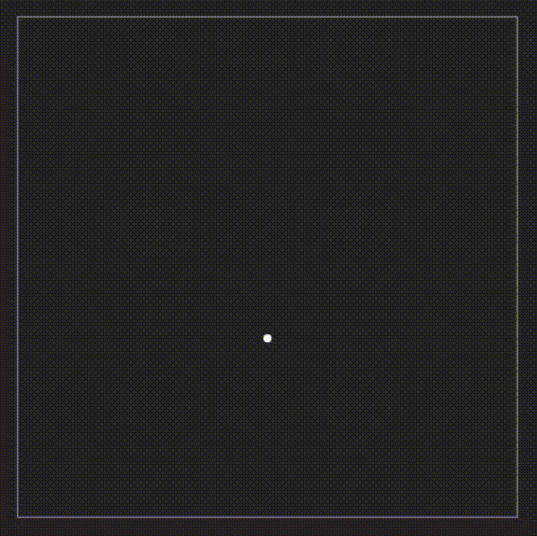
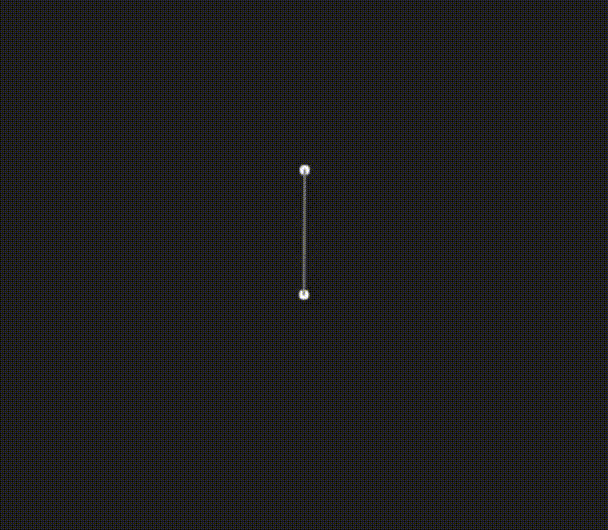

# Dynamical JS Doc
[Interactive landing page of Dynamical JS](https://dynamical.netlify.app/)

---
# Table of Contents
- [Introduction](#what-is-this)
- [Installation](#installation)
- [Getting Start](#getting-start)
	- [Renderer](#renderer)
	- [Point Mass](#point-mass)
	- [Distance Constraint](#distance-constraint)
---
# What is this?
Dynamical JS is a 2D JavaScript physic ~~engine~~ library. Please note that this is not a production-ready library. You can roughly simulate physical behaviours on HTML `<canvas>`. I created this for educational purpose only. The codebase is a bit messy, to say the least. On top of that, a simulated system would not conserve energy in an expected manner.

---
# Installation
### NPM
```sh
npm install dynamicaljs
```

Then include any required modules from the three different directories described under [Getting Start](#getting-start) section.

---
# Getting Start
This library provide both low and high level control over the simulation.

- `util/`
    - `renderer.js`: `Renderer`: draw shapes on HTML canvas, and rendering loop
    - `camera.js`: `Camera`: control field of view, and camera position
    - `input.js`: `Input`: get mouse input and position
    - `dynamical_vector.js`: `Vector`: provide mathematical operators on vector `{x: int, y: int, z: int}` (most method only work with x and y)
- `dynamical/`
    - `point_mass.js`: `PointMass`: handle updating its position based on acceleration using Verlet's Integration. 
    - `constraint.js`: `DistanceConstraint`: connect 2 points together like a piece of rod, `Container`: contain PointMasses inside a box. `CircleContainer`
    - `composite.js`: `Composite`: An abstraction for creating physical object. Based on `PointMass` & `DistanceConstraint`. `Composite` is also essential for detect/response to collision between object using `Collider`. For an easier experience, `composite.js` also contain `Rectangle` and `Circle` derived from `Composite`. The `Circle` is a special case of `Composite`.
- `collider/`
    - `collider.js`: `Collider`: provide a context (from stratergy pattern) for automatically checking/responding to the collision between all type of Composite and including `PointMass`. Please note that collider cannot check for collision between a `PointMass` and another `PointMass`.

---
## Renderer
Renderer consisted of method for rendering simple shapes (Circle, Line, and Polygon). It also contains a method for creating a rendering loop.

```html
<canvas id='canvas'></canvas>
```

```js
import { Renderer } from 'dynamicaljs';

const canvas = document.getElementById('canvas');
//renderer will set the canvas width and height to 500 by default
//To change width and height of the canvas, add extra aguments: new Renderer(canvas, 200, 300);
const renderer = new Renderer(canvas);
```

### Change background color

```js
renderer.setBackground('#202020');
```

### Drawing a circle

```js
//Give it a position (in Vector) and a radius
//then fill it with a color
renderer.circle(new Vector(250,250), 10)
    .setFillStyle('blue')
    .fill();

//to draw border around the circle
renderer.circle(new Vector(100,100), 50)
    .setFillStyle('red')
    .fill()
    .setStrokeStyle('white')
    .stroke();
```

Some other methods:
```js
//draw a circle at position (Vector) 
renderer.circle(position, radius); 
//draw a line from start to end (both are Vectors)
renderer.line(start, end, line_width); 
//draw a closed shape by looping through a list of Vectors (vertices) and draw lines through all of them. 
renderer.polygon(vertices); 
//clear anything on the canvas but keep the background color.
renderer.clear(); 
```

### `renderer.draw`

`renderer.draw` can be used to draw a `PointMass`, any `Constraint`, and any `Composite` by just passing the object as an argument. Drawing styles (size, color, border, etc) are based on the object's `Graphic` variable (check `util/graphic.js`).

```js
// import { PointMass, Renderer } from 'dynamicaljs';

const point = new PointMass(250,250);
point.graphic.fill('yellow');
point.graphic.stroke('white');
point.graphic.stroke_width = 5;

//parameters: physic_object (PointMass, Constraint, Composite)
renderer.draw(point);
```

### `renderer.update()`: loop
`renderer.update` invoke the call-back function passed in every frame and provide it with the change in time between frame

```js
renderer.update((dt)=>{
    renderer.clear();

    point.applyGravity();
    point.updatePosition(dt);

    container.check(point);

    renderer.draw(point);
});
```



Just in case if the code doesn't explain itself well: 
- Each loop we clear the screen.
- Perform all the necessary physic operations.
- Then render the object.

---
## Point Mass
You have already seen a bit about `PointMass`. But now let's dive deeper.

A point mass contain important information about a single point that act like a ball. It has position that can be updated using the `.updatePosition(changeInTime)` method. This method use **Verlet's integration** to calculate the next position of the point based on its acceleration and its previous position.

### Initialization
There are two ways to create a PointMass. 

#### Constructors
```js
import { PointMass } from 'dynamicaljs';

//parameters: x=250, y=250, mass=1, is_static=false
const point = new PointMass(250,250);
```

#### The `create` Method 
```js
const point = PointMass.create(250, 250);
```

#### Chaining methods
```js
point.setMass(1) // update point's mass
	.static() // turn point into a static point
	.setVelocity(new Vector(10, 0)) // override its current velocity with the new one
	.addVelocity(new Vector(0, 10)) // add new velocity to its current velocity
	.applyForce(new Vector(10, 1)) // add force / mass to its accelaration
	.applyGravity(new Vector(0, -9.8)) // Vector(0, 9.8) by default
	.setPosition(new Vector(0,0)) // set CURRENT position
	.setOldPosition(new Vector(0,0)) // set OLD position
```

>[!Note]
>- A static point is a point that works with constraints and composite but does not response to `updatePosition`. Basically, a dead point. 
>- Setting position and old_position of a point mass will influence its velocity (since v = current_position - old_position). 

### `updatePosition`
Based on the change in time and current state of the point (current position, old position, acceleration, mass, etc), this will calculate the new "current position". This is based on the Verlet's integration method. 

```js
//parameters: delta_time=0.25
point.updatePosition(0.25);
```


---
## Distance Constraint
PointMass alone is nothing special. This is when constraint comes in. Distance constraint, as the name suggested, restrict the **distance** between **two PointMasses**. 

```js
import { PointMass, DistanceConstraint } from 'dynamicaljs';

const p1 = new PointMass(200, 250);
const p2 = new PointMass(300, 250);

const rod = new DistanceConstraint(p1, p2);
```
### The `spring_constant` variable
`spring_constant` tell how springy the constraint is. `1` for a rigid spring (not springy at all). The smaller it is, the springier it gets.

```js
//spring_constant can be set by passing the third argument to the constructor
const rod = new DistanceConstraint(point1, point2, spring_constant=1);
//or using the setSpringConstant method
rod.setSpringConstant(0.5);
```

### The `check` Method
```js
rod.check();
```

This will check if the distance between `p1` and `p2` is further or closer than their initial distance apart. After that, the `DistanceConstraint` will **automatically** resolve both `p1` and `p2` by updating their position and velocity accordingly.

`DistanceConstraint` presents endless possibilities for simulating simple physic behaviour. 

### A pendulum example

```js
//import { PointMass, DistanceConstraint, Renderer } from 'dynamicaljs';

const canvas = document.getElementById('canvas');

const renderer = new Renderer(canvas);
renderer.setBackground('#202020');

const p1 = new PointMass(250, 200).static(); //fixed this point in place 
const p2 = new PointMass(350, 200);

const rod = new DistanceConstraint(p1, p2);

renderer.update((delta_time)=>{
	p2.applyGravity();

	//check the constraint
	rod.check();

	p2.updatePosition(delta_time);

	renderer.clear();
	renderer.draw(p1);
	renderer.draw(p2);
	renderer.draw(rod);
});
```



> [!Note]
> The system does not conserve energy (energy lost overtime). So I decided to make loose even faster to get a more realistic result.

---

